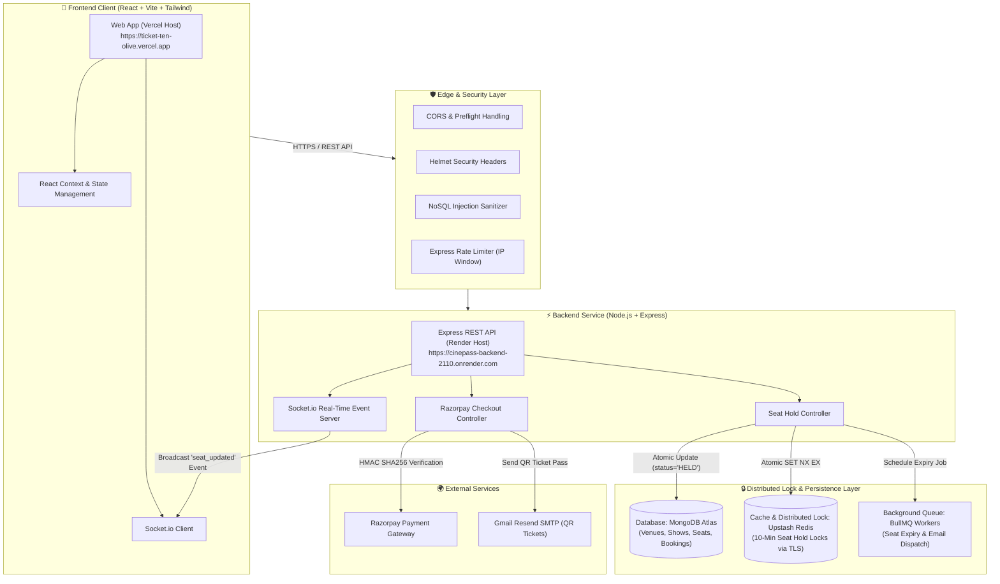
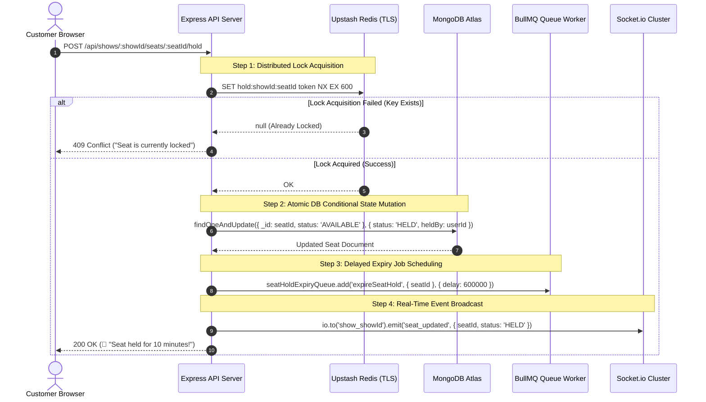
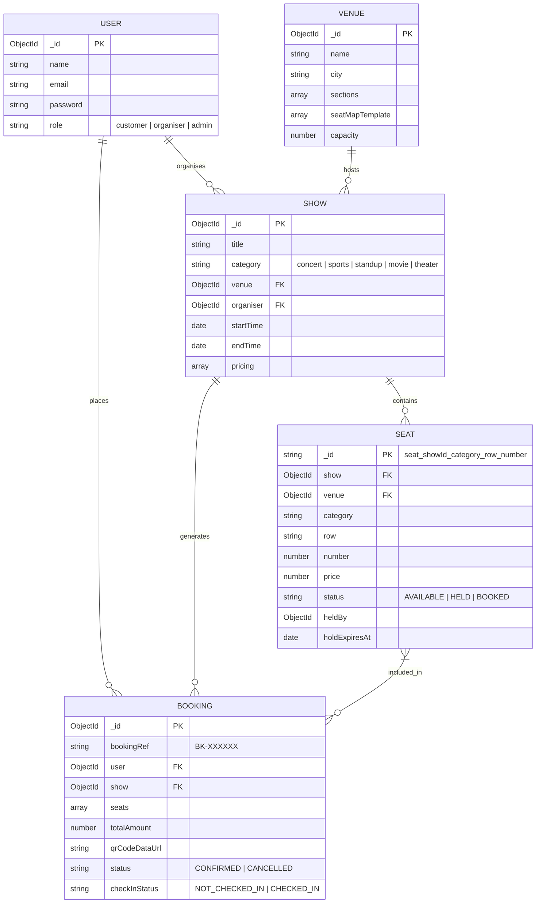

# 🏗️ CinePass: Enterprise High-Concurrency System Design & Architecture

> **CinePass** is an enterprise-grade, high-concurrency ticket booking platform engineered for high-demand events (IPL Finals, Stadium Concerts, and Movie Premieres). It guarantees zero double-bookings using **Distributed Redis Locks**, **Atomic Lua Scripts**, **BullMQ Expiry Queues**, and **Real-Time WebSocket Synchronization**.

---

## 📐 1. System Architecture Overview

The system follows a strict **Decoupled Client-Server Monorepo Architecture** separating high-frequency frontend renders from distributed state lock management.



---

## ⚡ 2. High-Concurrency Seat Hold & Lock Engine

To eliminate race conditions when thousands of users attempt to select the same seat simultaneously, seat reservation follows a **Two-Tier Distributed Lock Strategy**:



---

## 🔒 3. Atomic Lua Script for Safe Lock Release

When a 10-minute hold expires or a user releases a seat, locks must only be deleted if the stored token matches the owner. CinePass uses an **Atomic Lua Script (`GET + compare + DEL`)**:

```lua
-- Atomic Lua Script: Executed via EVAL in ioredis
if redis.call("get", KEYS[1]) == ARGV[1] then
    return redis.call("del", KEYS[1])
else
    return 0
end
```

### Key Technical Advantages:
- **Zero Race Conditions**: Eliminates scenario where User B acquires an expired lock right before User A's slow process deletes it.
- **Microsecond Latency**: Executed atomically on single-threaded Redis server runtime.

---

## 🗄️ 4. Database Entity-Relationship Diagram (ERD)



---

## 🛠️ 5. Tech Stack & Architectural Layering

| Layer | Technologies Used | Core Responsibilities |
| :--- | :--- | :--- |
| **Frontend UI** | React 18, Vite, Tailwind CSS, Lucide Icons | Responsive UI, interactive seat grid canvas, live 10-min countdown timer. |
| **Backend API** | Node.js, Express.js | REST APIs, input validation, role middleware, rate limiting. |
| **Real-Time Sockets** | Socket.io | Bi-directional WebSocket rooms (`show_:id`) for live seat color updates. |
| **Distributed Lock** | Upstash Redis (`ioredis` + TLS) | `SET NX EX` distributed locking & atomic Lua script releases. |
| **Background Queues** | BullMQ | Delayed jobs for seat hold expiries (600s) & async email processing. |
| **Primary Database** | MongoDB Atlas (Mongoose ORM) | Document persistence, compound indexing (`{ show: 1, status: 1 }`). |
| **Security & Auth** | JWT, bcrypt, Helmet, Express-Rate-Limit | Token authentication, password hashing, XSS/NoSQL protection. |
| **Payment Gateway** | Razorpay SDK & Webhooks | HMAC SHA256 signature verification for INR transactions. |

---

## 🛡️ 6. Reliability & Fallback Safeguards

1. **Redis Offline Fallback**:
   - If Upstash Redis connection times out (`connectTimeout: 5000`), the platform seamlessly switches to `ioredis-mock` in memory without dropping client requests.
2. **Render Cold-Start Protection**:
   - `server.listen(PORT, '0.0.0.0')` binds immediately upon startup so cloud load balancers never drop connections (`socket hang up`).
3. **Database Preflight Auto-Connection**:
   - Every repository call (`ShowRepo`, `SeatRepo`, `VenueRepo`) enforces `ensureConnection()` before executing queries.
