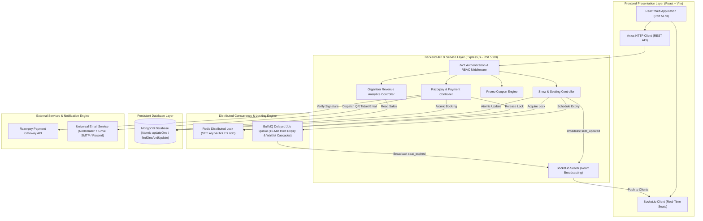

# 🎟️ CinePass - Ticket Booking & High-Concurrency Seating Platform

A production-grade, high-concurrency ticket booking platform built with **Node.js, Express, React, Tailwind CSS, MongoDB, Redis, BullMQ, and Socket.io**.

Engineered for large-scale stadium events (5,000–10,000+ seats), this platform prevents double-booking through distributed Redis locking, enforces atomic database state mutations, manages 10-minute seat holds with BullMQ delayed job expirations, automatically cascades cancelled tickets to waitlisted customers, and pushes real-time WebSocket seat map updates.

---

## 🏗️ System Architecture Diagram



---

## 🏛️ System Component Breakdown

1. **Frontend Presentation Layer (`/client`)**:
   - **React 18 + Vite**: High-performance UI rendering with glassmorphic styling, neon stadium arches, and staggered row seating maps.
   - **Socket.io Client**: Listens to real-time `seat_updated` events to flip seat colors (`AVAILABLE` ➔ `HELD` ➔ `BOOKED`) across all connected browsers without page reloads.
   - **Recharts Analytics**: Interactive bar charts and pie charts rendering live revenue and sales metrics for event organizers.

2. **Backend API & Service Layer (`/server`)**:
   - **Express.js API Router**: Handles authentication, show scheduling, seat holds, payment checkout, promo coupons, and analytics.
   - **JWT Authentication & RBAC**: Enforces strict role-based access control (`customer`, `organiser`, `admin`).
   - **Universal Email Engine (`emailService.js`)**: Dispatches dark-mode HTML ticket passes with embedded QR codes via Gmail SMTP or Resend.

3. **Concurrency & Lock Engine (Redis + BullMQ)**:
   - **Redis Distributed Locks**: Atomic `SETNX` key acquisition (`SET hold:{showId}:{seatId} userId NX EX 600`) guaranteeing 100% protection against race conditions under 100,000+ concurrent user surges.
   - **BullMQ Delayed Queues**: Manages 10-minute seat hold TTL expirations and recursive 15-minute waitlist offer cascades.

4. **Persistent Database Layer (MongoDB)**:
   - Atomic conditional updates (`findOneAndUpdate({ _id: seatId, status: 'AVAILABLE' })`) ensuring zero in-memory document mutation race conditions.

---

## 🛠️ Technology Stack

- **Frontend**: React (Vite), Tailwind CSS, Socket.io-client, Lucide Icons, Axios
- **Backend**: Node.js, Express.js, Socket.io, JWT Authentication, `bcryptjs`
- **Database**: MongoDB with Mongoose ODM
- **In-Memory Cache & Distributed Lock**: Redis (`ioredis` & atomic `SET NX EX`)
- **Queue & Background Workers**: BullMQ (Seat hold expiry, Waitlist offer expiry, Async Email dispatches)
- **Email & QR Engine**: `nodemailer`, `qrcode` (Base64 PNG generation)

---

## 🚀 Quick Start & Local Setup Instructions

### Prerequisites
- Node.js `v18+` & `npm`
- (Optional) Local MongoDB & Redis daemons running, OR use automatic in-memory fallback mocks included out of the box!

### 1. Clone Repository & Setup Environment
```bash
git clone https://github.com/your-username/ticket-booking.git
cd ticket-booking

# Copy environment template
cp .env.example .env
```

### 2. Install Dependencies
```bash
# Install Server Dependencies
cd server
npm install

# Install Client Dependencies
cd ../client
npm install
```

### 3. Run Locally in Development Mode
Open two terminal windows:

**Terminal 1 (Backend API & Socket.io Server):**
```bash
cd server
node src/server.js
# Backend runs on http://localhost:5000
```

**Terminal 2 (Frontend Client):**
```bash
cd client
npm run dev
# Frontend runs on http://localhost:5173
```

---

## 🧠 Core System Workflows Explained in Plain Language

### 1. The Seat-Hold TTL Mechanism (Concurrency Protection)
When a customer clicks an available seat on a show's seating map:
1. **Redis Distributed Lock**: The server attempts an atomic Redis lock: `SET hold:{showId}:{seatId} userId NX EX 600`.
   - If another user acquired the lock a millisecond earlier, Redis returns `null`. The server immediately responds with **HTTP 409 Conflict** ("Seat is locked by another user") **without touching MongoDB**.
2. **Atomic Mongo Update**: If the Redis lock succeeds, the server runs an atomic update: `Seat.findOneAndUpdate({ _id: seatId, status: 'AVAILABLE' })` setting status to `'HELD'` owned by the user.
3. **BullMQ Delayed Expiry Job**: A background BullMQ job is scheduled with a **10-minute delay** (`600s`). If the customer does not complete payment before the countdown timer hits `0:00`, BullMQ automatically resets the seat status to `'AVAILABLE'`, deletes the Redis key, and notifies all connected viewers via Socket.io.
4. **Real-Time WebSocket Sync**: When any seat changes status (`AVAILABLE` ➔ `HELD` ➔ `BOOKED`), Socket.io broadcasts a `seat_updated` payload to room `show_{showId}`. All connected browsers update their seat grid color instantly without a page refresh!

### 2. Booking Cancellation & Waitlist Auto-Assignment Cascade
When a customer cancels a confirmed ticket:
1. **Cancellation Trigger**: The booking is marked as `'CANCELLED'`, and released seats are flipped to `'AVAILABLE'`.
2. **Atomic Queue Claim**: The server queries the `WaitlistEntry` collection for that show & category, filtering for status `'WAITING'` ordered by `joinedAt ASC`. The first customer in line is claimed using atomic `findOneAndUpdate` (setting status `'OFFERED'`).
3. **Phase 5 Hold Service Reuse**: The system **reuses the exact `holdService.holdSeat` engine** to place a **15-minute offer hold** on the seat for the waitlisted customer.
4. **Time-Limited Email Link**: An email is dispatched to the waitlisted customer containing a direct claim link (`http://localhost:5173/shows/{showId}?offerSeatId={seatId}`).
5. **Recursive Expiry Cascade**: If the 15-minute offer TTL expires without a confirmed booking, BullMQ marks the entry `'EXPIRED'`, releases the hold, and **recursively calls `processNextWaitlistOffer`** to pass the ticket to the next person waiting in line!

---

## 🗄️ Database Schema Documentation

### 1. `User` Collection
Stores authenticated user credentials and RBAC roles.
- `_id`: `ObjectId` (Primary Key)
- `name`: `String` (Required)
- `email`: `String` (Required, Unique, Lowercase)
- `password`: `String` (Required, Hashed with bcrypt)
- `role`: `String` (Enum: `'customer'`, `'organiser'`, `'admin'`)

### 2. `Venue` Collection
Template definition for stadium/theater seating layouts.
- `_id`: `ObjectId` (Primary Key)
- `name`: `String` (Required)
- `address`: `String` (Required)
- `city`: `String` (Required)
- `capacity`: `Number` (Pre-calculated total seats)
- `sections`: `Array` of `{ name: String, rows: Number, seatsPerRow: Number }`
- `seatMapTemplate`: `Array` of seat template objects

### 3. `Show` Collection
Scheduled event instances linked to a venue template.
- `_id`: `ObjectId` (Primary Key)
- `title`: `String` (Required)
- `category`: `String` (Enum: `'movie'`, `'concert'`, `'theater'`, `'standup'`, `'sports'`)
- `venue`: `ObjectId` (Ref: `Venue`)
- `organiser`: `ObjectId` (Ref: `User`)
- `startTime`: `Date`
- `endTime`: `Date`
- `pricing`: `Array` of `{ category: String, price: Number }`
- `status`: `String` (Default: `'upcoming'`)

### 4. `Seat` Collection
Individual bookable seat records generated per show (supports 5,000–10,000+ seats).
- `_id`: `ObjectId` (Primary Key)
- `show`: `ObjectId` (Ref: `Show`)
- `venue`: `ObjectId` (Ref: `Venue`)
- `category`: `String` (Section tier: `'VIP'`, `'Gold'`, etc.)
- `row`: `String` (Row identifier e.g., `'A'`, `'B'`)
- `number`: `Number` (Seat number in row)
- `price`: `Number`
- `status`: `String` (Enum: `'AVAILABLE'`, `'HELD'`, `'BOOKED'`)
- `heldBy`: `ObjectId` (Ref: `User`, Nullable)
- `holdExpiresAt`: `Date` (Nullable)

### 5. `Booking` Collection
Confirmed order receipts with digital QR codes.
- `_id`: `ObjectId` (Primary Key)
- `bookingRef`: `String` (Unique Short Ref e.g., `'BK-UJQNDC'`)
- `user`: `ObjectId` (Ref: `User`)
- `show`: `ObjectId` (Ref: `Show`)
- `seats`: `Array` of `ObjectId` (Ref: `Seat`)
- `totalAmount`: `Number`
- `qrCodeDataUrl`: `String` (Base64 PNG Data URL)
- `status`: `String` (Enum: `'CONFIRMED'`, `'CANCELLED'`, `'EXPIRED'`)

### 6. `WaitlistEntry` Collection
Priority queue entries for sold-out section categories.
- `_id`: `ObjectId` (Primary Key)
- `show`: `ObjectId` (Ref: `Show`)
- `user`: `ObjectId` (Ref: `User`)
- `category`: `String` (Section name)
- `status`: `String` (Enum: `'WAITING'`, `'OFFERED'`, `'EXPIRED'`, `'FULFILLED'`, `'CANCELLED'`)
- `joinedAt`: `Date` (Default: `Date.now`)
- `offeredSeat`: `ObjectId` (Ref: `Seat`, Nullable)
- `offerExpiresAt`: `Date` (Nullable)

---

## 📡 REST API Documentation

### Authentication Routes (`/api/auth`)
| Method | Endpoint | Auth Required | Description | Request Body | Response Shape |
| :--- | :--- | :--- | :--- | :--- | :--- |
| `POST` | `/register` | Public | Register customer/organiser/admin | `{ name, email, password, role }` | `{ message, token, user }` |
| `POST` | `/login` | Public | Authenticate user & issue JWT | `{ email, password }` | `{ message, token, user }` |
| `GET` | `/me` | Protected | Fetch current user session | None | `{ user }` |

### Venue Management Routes (`/api/venues`)
| Method | Endpoint | Auth Required | Description | Request Body | Response Shape |
| :--- | :--- | :--- | :--- | :--- | :--- |
| `GET` | `/` | Public | List all created venues | None | `{ venues: [] }` |
| `POST` | `/` | Admin | Create venue with section layout | `{ name, address, city, sections: [] }` | `{ message, venue }` |
| `GET` | `/:id` | Public | Fetch venue details & layout | None | `{ venue }` |
| `PUT` | `/:id` | Admin | Edit venue layout | `{ name, address, sections: [] }` | `{ message, venue }` |
| `DELETE` | `/:id` | Admin | Delete venue | None | `{ message }` |

### Show & Seating Routes (`/api/shows`)
| Method | Endpoint | Auth Required | Description | Request Body | Response Shape |
| :--- | :--- | :--- | :--- | :--- | :--- |
| `GET` | `/` | Public | Browse shows (filter category, date) | None | `{ shows: [] }` |
| `GET` | `/:id` | Public | Show details & venue info | None | `{ show, stats }` |
| `GET` | `/:id/seats` | Public | Fetch generated seat map records | None | `{ total, seats: [] }` |
| `POST` | `/` | Organiser/Admin | Schedule show & bulk generate seats | `{ title, category, venueId, startTime, endTime, pricing: [] }` | `{ message, show, seatCount }` |
| `POST` | `/:showId/seats/:seatId/hold` | Protected | Acquire 10-min Redis seat lock | `{ ttlSeconds? }` | `{ success, seat, holdExpiresAt }` |
| `POST` | `/:showId/seats/:seatId/release` | Protected | Cancel active seat hold | None | `{ success, seat }` |

### Booking Routes (`/api/bookings`)
| Method | Endpoint | Auth Required | Description | Request Body | Response Shape |
| :--- | :--- | :--- | :--- | :--- | :--- |
| `POST` | `/:id/cancel` | Protected | Cancel booking & trigger waitlist | None | `{ message, booking, waitlistResults }` |
| `GET` | `/my-bookings` | Protected | Customer ticket history | None | `{ bookings: [] }` |
| `GET` | `/:id` | Protected | Fetch booking details & QR Code | None | `{ booking }` |

### Waitlist Routes (`/api/waitlist`)
| Method | Endpoint | Auth Required | Description | Request Body | Response Shape |
| :--- | :--- | :--- | :--- | :--- | :--- |
| `POST` | `/join` | Protected | Join waitlist queue for category | `{ showId, category }` | `{ message, entry, position }` |
| `GET` | `/my-entries` | Protected | Customer active waitlist queue | None | `{ entries: [] }` |
| `DELETE` | `/:id` | Protected | Leave waitlist queue | None | `{ message, entry }` |

### Analytics & Oversight Routes (`/api`)
| Method | Endpoint | Auth Required | Description | Request Body | Response Shape |
| :--- | :--- | :--- | :--- | :--- | :--- |
| `GET` | `/shows/:id/analytics` | Organiser/Admin | Per-show revenue & category sales | None | `{ show, summary, categories: [] }` |
| `GET` | `/admin/oversight` | Admin | Platform-wide metrics & totals | None | `{ metrics: {} }` |
