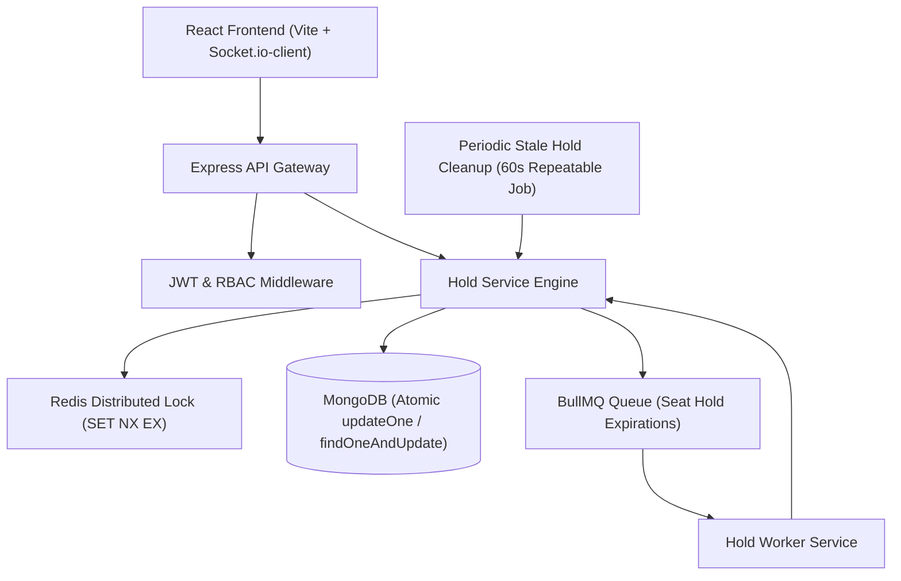

# 📐 System Design & Architecture Specification

## 1. High-Level Architecture Overview

CinePass is a production-grade, high-concurrency event ticketing platform engineered to handle massive booking spikes (5,000–10,000+ seats) without double-booking or race conditions.

---

## 2. Concurrency & Data Consistency Strategy

### A. Atomic Distributed Locking (`SET key lockToken NX EX ttl`)
- Before mutating a seat's state in MongoDB, a Redis lock is acquired using `acquireRedisLock(key, lockToken, ttl)`.
- **Lock Token Verification**: Each lock is issued with a unique `crypto.randomUUID()` token.
- **Safe Release via Lua Script**: Lock releases execute an atomic Lua script (`GET + compare + DEL` via `EVAL`). If a process experiences a lag exceeding the 10-minute TTL, it cannot delete locks owned by subsequent users.

### B. Atomic Database State Mutations
- All MongoDB state changes use atomic conditional queries:
  - **Hold**: `{ _id: seatId, show: showId, status: 'AVAILABLE' }`
  - **Confirm**: `{ _id: seatId, show: showId, status: 'HELD', heldBy: userId, holdExpiresAt: { $gt: now } }`
  - **Release / Expiry**: `{ _id: seatId, show: showId, status: 'HELD', heldBy: userId }`

### C. Single Secure Confirmation Path (`/api/payments/verify`)
- **Security Compliance**: Un-authenticated payment bypass route `/api/bookings/confirm` has been deleted.
- **Single Source of Truth**: `/api/payments/verify` is the ONLY endpoint authorized to convert seats from `HELD` to `BOOKED`. It enforces Razorpay HMAC signature verification prior to performing atomic database updates, generating digital QR tickets, releasing Redis locks, and queuing email dispatches.

---

## 🔄 Note on Resiliency: Periodic Stale Hold Cleanup (60s Recovery Engine)

> [!IMPORTANT]
> **Redis Restart & Job Loss Fault-Tolerance**:
> If a Redis instance restarts or crashes, delayed BullMQ jobs stored strictly in memory can be lost. To prevent orphaned seat holds (seats stuck permanently in `HELD` status after Redis recovers), the platform runs a **60-second periodic cleanup worker** (via a BullMQ repeatable job `repeat: { every: 60000 }` and interval fallback).
>
> The cleanup engine queries MongoDB / repository layer for seats where:
> $$\text{status} = \text{'HELD'} \quad \text{AND} \quad \text{holdExpiresAt} \le \text{Date.now()}$$
>
> It reuses `holdService.releaseSeatHold()` to safely return expired seats to `AVAILABLE` status and broadcast Socket.io updates to connected browsers, guaranteeing zero orphaned seats.

---

## 3. Real-Time Synchronization Engine
- Socket.io broadcasts `seat_updated` events to room `show_{showId}` whenever a seat transitions (`AVAILABLE` ➔ `HELD` ➔ `BOOKED` ➔ `AVAILABLE`).
- Viewers see instant color shifts without manual page refreshes.
